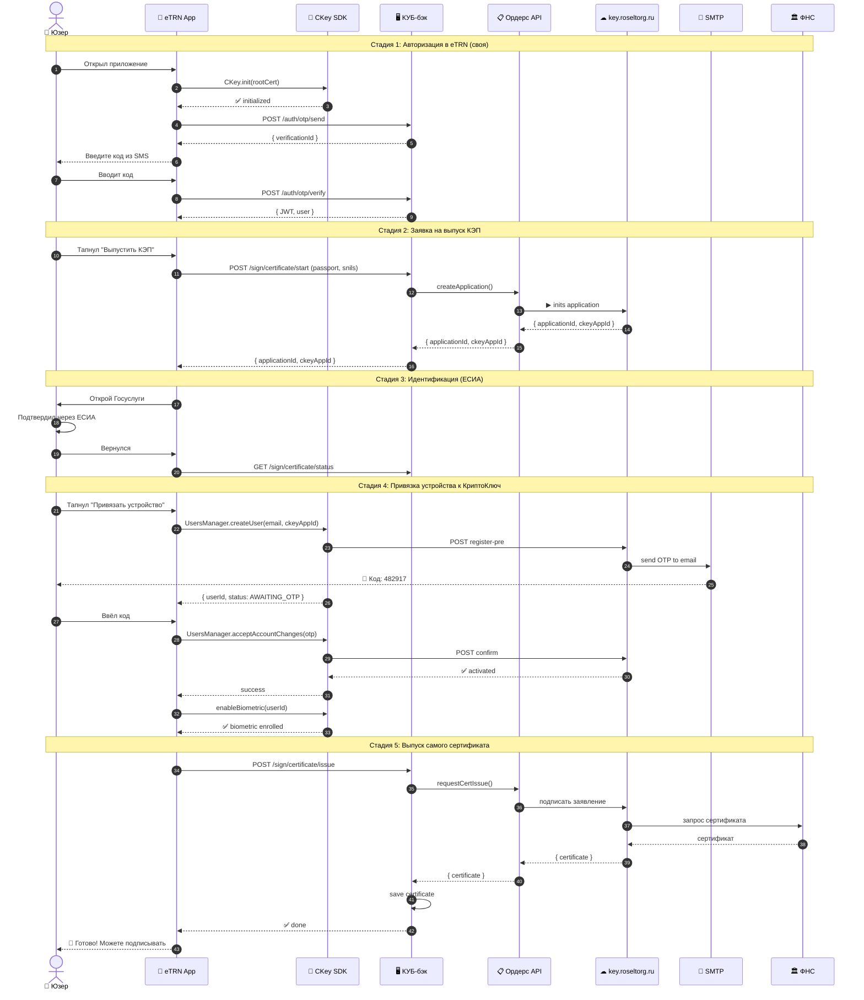
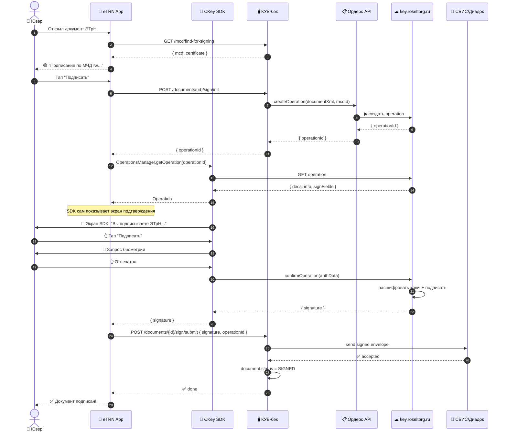

# 🔐 КриптоКлюч × eTRN — полная карта работы

> Документ для всех: бэкендера, Android-разработчика, продакта, тестировщика.
> Объясняет КАК это работает с двух сторон одновременно — что видит юзер и что
> делается под капотом.

**Кто партнёр:** РосЭлТорг + СТ Крипт. Их продукт — **CKey SDK** (нативный Android/iOS) + сервер `key.roseltorg.ru` + сервис **Ордерс** для бэка.

---

## 1. Кто играет в этой пьесе

```
   ┌────────────────────────────────────────────────────────────────────────┐
   │                        🎭  АКТЁРЫ                                       │
   ├────────────────────────────────────────────────────────────────────────┤
   │                                                                         │
   │  👤 ЮЗЕР                  📱 eTRN ANDROID            🖥  КУБ-БЭКЕНД      │
   │  (водитель,               (наше приложение           (lasamb.tw1.ru)    │
   │   логист, ИП)              из Google Play)            наш REST API      │
   │      │                          │                          │            │
   │      │                          │                          │            │
   │      ▼                          ▼                          ▼            │
   │  ┌────────────────────────────────────────────────────────────────────┐ │
   │  │         🌐  ПАРТНЁР: РОСЭЛТОРГ + СТ КРИПТ                           │ │
   │  │                                                                     │ │
   │  │   🔐 CKey SDK   →   ☁  key.roseltorg.ru   →   📋 Ордерс REST API   │ │
   │  │   (внутри                сервер                  (для нашего бэка) │ │
   │  │    Android-app)         КриптоПРО КЛЮЧ                              │ │
   │  │                              │                                       │ │
   │  │                              ▼                                       │ │
   │  │                         🏛  ФНС                                     │ │
   │  │                    (реестр МЧД и                                    │ │
   │  │                     сертификатов)                                   │ │
   │  └────────────────────────────────────────────────────────────────────┘ │
   └────────────────────────────────────────────────────────────────────────┘
```

**Ключевая идея:**
- **Ключ подписи лежит на сервере КриптоПРО**, не у юзера на телефоне
- **Юзер на телефоне ПОДТВЕРЖДАЕТ** действия (биометрия / пароль)
- **Наш Android-app встраивает SDK** через который происходит подтверждение
- **Наш бэкенд через Ордерс API** заводит юзеров и отправляет документы на подпись

Это называется **«облачная подпись с мобильным подтверждением»**.

---

## 2. Большая картина — две основные истории

### История A: 🆕 Юзер первый раз ставит eTRN и выпускает КЭП

```
1️⃣  Скачал → 2️⃣ Зарегился → 3️⃣ Выпустил КЭП → 4️⃣ Готов подписывать
```

### История B: 📝 Юзер подписывает документ ЭТрН

```
1️⃣  Получил документ → 2️⃣ Открыл → 3️⃣ Тапнул «Подписать» → 4️⃣ Биометрия → ✅
```

Обе истории разберём по шагам с экранами и технической изнанкой.

---

## 3. 📜 ИСТОРИЯ A — Регистрация и выпуск КЭП

### CJM (что видит юзер) + что под капотом

```
═══════════════════════════════════════════════════════════════════════════════
  ШАГ 1.  Welcome-экран
═══════════════════════════════════════════════════════════════════════════════

   👤 ЮЗЕР                                    🖥  ПОД КАПОТОМ

   ┌──────────────────────┐
   │       eTRN           │                    Application.onCreate():
   │                      │                    ▶ CKey.init(rootCertProd)
   │  📋  ЭТрН в кармане  │                    ◉ SDK инициализирован
   │                      │
   │  [   Войти   ]       │                    UsersManager.listStorage()
   │  [ Попробовать демо] │                    → пусто, юзер новый
   │                      │
   └──────────────────────┘

═══════════════════════════════════════════════════════════════════════════════
  ШАГ 2.  Ввод телефона + SMS
═══════════════════════════════════════════════════════════════════════════════

   👤 ЮЗЕР                                    🖥  ПОД КАПОТОМ

   ┌──────────────────────┐
   │  📞  Ваш телефон     │                    POST /auth/otp/send
   │  +7 ___ ___ __ __    │  ───►              { phone, deviceId }
   │  [Получить код]      │                    ← { verificationId }
   └──────────────────────┘

   ┌──────────────────────┐
   │  Введите код из SMS  │                    POST /auth/otp/verify
   │  [_][_][_][_]        │  ───►              { code, verificationId }
   │  [Подтвердить]       │                    ← { accessToken, user }
   └──────────────────────┘

   📱 ПУШ от eTRN-сервера                      Юзер залогинен в КУБ-бэке.
   "Код: 1111"                                 КриптоКлюч ещё не задействован!

═══════════════════════════════════════════════════════════════════════════════
  ШАГ 3.  Онбординг — заполнение ИНН
═══════════════════════════════════════════════════════════════════════════════

   👤 ЮЗЕР                                    🖥  ПОД КАПОТОМ

   ┌──────────────────────┐
   │  Найдём вас в ЕГРЮЛ  │
   │                      │
   │  ИНН _________       │  ───►              GET /dadata/party?inn=...
   │                      │                    ← { name, ogrn, kind, ... }
   │  🏢 ООО ТрансЛог.    │
   │  ИНН 7712345678      │
   │  Руководитель: ...   │
   │                      │                    PUT /profile
   │  Email _______       │                    ← user обновлён
   │  [Продолжить]        │
   └──────────────────────┘

═══════════════════════════════════════════════════════════════════════════════
  ШАГ 4.  Dashboard — баннер "Выпустить КЭП"
═══════════════════════════════════════════════════════════════════════════════

   👤 ЮЗЕР                                    🖥  ПОД КАПОТОМ

   ┌──────────────────────┐
   │  Главная             │                    GET /certificates/me
   │ ───────────────────  │                    ← null (нет КЭП)
   │  🔴 КЭП не выпущен.  │
   │  Без него не можете  │
   │  подписывать. [→]    │
   │                      │
   │  📄 0 документов     │
   │     к подписи        │
   └──────────────────────┘

   👆 тап на красный баннер

═══════════════════════════════════════════════════════════════════════════════
  ШАГ 5.  Анкета на выпуск КЭП  (наша форма, ещё не CKey)
═══════════════════════════════════════════════════════════════════════════════

   👤 ЮЗЕР                                    🖥  ПОД КАПОТОМ

   ┌──────────────────────┐
   │  Выпуск УКЭП         │
   │                      │
   │  ФИО       (auto)    │                    POST /sign/certificate/start
   │  Паспорт   ____      │  ───►              {
   │  СНИЛС     ____      │                      passport, snils, email,
   │  Email     (auto)    │                      provider: "cryptokey"
   │                      │                    }
   │  [Продолжить]        │                    ← {
   │                      │                        applicationId: 769456,
   └──────────────────────┘                        ckeyAppId: "etrn-prod"
                                                  }

                                              КУБ через Ордерс API:
                                              ▶ создаёт application в УЦ
                                              ▶ возвращает applicationId

═══════════════════════════════════════════════════════════════════════════════
  ШАГ 6.  Идентификация через ЕСИА (Госуслуги)
═══════════════════════════════════════════════════════════════════════════════

   👤 ЮЗЕР                                    🖥  ПОД КАПОТОМ

   ┌──────────────────────┐
   │  Подтвердите личность│                    Открываем Custom Tab:
   │                      │                    https://esia.gosuslugi.ru/...
   │  • Через Госуслуги   │
   │  ○ Видеозвонок       │                    После redirect:
   │                      │                    GET /sign/certificate/identification/callback
   │  [Продолжить]        │  ───►              ← { status: "verified" }
   └──────────────────────┘

═══════════════════════════════════════════════════════════════════════════════
  ШАГ 7.  Привязка устройства к КриптоКлюч 🔥 ВОТ ТУТ ВКЛЮЧАЕТСЯ SDK
═══════════════════════════════════════════════════════════════════════════════

   👤 ЮЗЕР                                    🖥  ПОД КАПОТОМ + 🔐 SDK

   ┌──────────────────────┐
   │  Привязка устройства │                    UsersManager.createUser(
   │                      │                      login = user.email,
   │  Этот телефон станет │                      applicationId = ckeyAppId,
   │  ключом для подписи. │                      deviceName = Build.MODEL
   │  Подтвердите код,    │                    )
   │  который придёт      │  ───►
   │  на email.           │                    🔐 SDK → key.roseltorg.ru:
   │                      │                       создать предрегистрацию
   │  [Отправить код]     │
   └──────────────────────┘                    📧 Сервер → SMTP → email юзера
                                               "Ваш код: 482917"

   📧 Email: "Код активации                    callback: { userId, status: AWAITING_OTP }
   КриптоКЛЮЧ: 482917"

═══════════════════════════════════════════════════════════════════════════════
  ШАГ 8.  Юзер вводит код из email
═══════════════════════════════════════════════════════════════════════════════

   👤 ЮЗЕР                                    🖥  ПОД КАПОТОМ + 🔐 SDK

   ┌──────────────────────┐
   │  Введите код из      │
   │  письма от           │                    UsersManager.acceptAccountChanges(
   │  КриптоКЛЮЧ          │                      userId, otp = "482917"
   │                      │  ───►              )
   │  [482917]            │
   │                      │                    🔐 SDK → key.roseltorg.ru:
   │  [Подтвердить]       │                       подтвердить регистрацию
   └──────────────────────┘                    ← user активирован
                                               На устройстве: создан keystore
                                               запись с auth-вектором

═══════════════════════════════════════════════════════════════════════════════
  ШАГ 9.  Установка биометрии
═══════════════════════════════════════════════════════════════════════════════

   👤 ЮЗЕР                                    🖥  ПОД КАПОТОМ + 🔐 SDK

   ┌──────────────────────┐
   │  Включить отпечаток? │
   │                      │                    AuthMethodsManager.enableBiometric(
   │  Чтобы подписывать   │                      userId
   │  одним касанием.     │  ───►              )
   │                      │                    Android KeyStore:
   │  👆 Приложите палец  │                    создаётся пара ключей,
   │                      │                    private key защищён
   │  [Включить]          │                    биометрией
   │  [Пропустить]        │
   └──────────────────────┘

═══════════════════════════════════════════════════════════════════════════════
  ШАГ 10.  Выпуск самого сертификата ФНС
═══════════════════════════════════════════════════════════════════════════════

   👤 ЮЗЕР                                    🖥  ПОД КАПОТОМ

   ┌──────────────────────┐
   │  Выпуск сертификата  │                    POST /sign/certificate/issue
   │                      │  ───►              { applicationId: 769456 }
   │  ⏳ Проверка ФНС      │
   │  ✅ Подписание заявки │                    КУБ → Ордерс API → ПАК УЦ:
   │  ⏳ Регистрация в ФНС │                    1. Сформировать заявление
   │                      │                    2. Подписать через сервер
   │  Это может занять    │                    3. Отправить в ФНС
   │  2-5 минут.          │                    4. Получить сертификат
   │                      │
   └──────────────────────┘                    Polling:
                                               GET /sign/certificate/status?applicationId=
                                               ← { status: "in_progress" → "done" }

═══════════════════════════════════════════════════════════════════════════════
  ШАГ 11.  Готово!
═══════════════════════════════════════════════════════════════════════════════

   👤 ЮЗЕР                                    🖥  ПОД КАПОТОМ

   ┌──────────────────────┐
   │  ✅ Сертификат готов!│                    GET /certificates/me
   │                      │                    ← {
   │  Иванов Иван Ив.     │                       subject, validUntil,
   │  ИНН 770123456789    │                       thumbprint, ...
   │  до 25.04.2027       │                    }
   │                      │
   │  Теперь можете       │                    Push-notification:
   │  подписывать ЭТрН    │                    "🎉 КЭП выпущен"
   │                      │
   │  [На главную]        │
   └──────────────────────┘
```

### Resumé истории A — что должно быть на бэке и в приложении

| Что | Кто делает |
|---|---|
| Хранилище `applications` (заявки на выпуск) | КУБ-бэк |
| Хранилище `certificates` (готовые КЭП) | КУБ-бэк |
| `POST /sign/certificate/start` создаёт application в Ордерс | КУБ-бэк |
| `CKey.init()` в `Application.onCreate()` | Android |
| `UsersManager.createUser()` + `acceptAccountChanges()` | Android |
| `AuthMethodsManager.enableBiometric()` | Android |
| Polling статуса заявки | Android |
| `GET /certificates/me` в `Dashboard` | Android+бэк |

---

## 4. 📝 ИСТОРИЯ B — Подписание документа

```
═══════════════════════════════════════════════════════════════════════════════
  ШАГ 1.  Юзер открывает eTRN, видит новый документ
═══════════════════════════════════════════════════════════════════════════════

   👤 ЮЗЕР                                    🖥  ПОД КАПОТОМ

   📱 PUSH:                                    Webhook от оператора ЭДО (СБИС/Диадок)
   "Новый ЭТрН на подпись                      → КУБ-бэк сохраняет document
    от ООО АгроТрейд"                          → отправляет push (FCM)

   ┌──────────────────────┐
   │  Главная             │                    GET /documents/counts
   │ ───────────────────  │                    ← { needSign: 1, ... }
   │                      │
   │  📄 1 документ       │                    GET /documents?status=NEED_SIGN
   │     к подписи  [→]   │                    ← список
   │                      │
   └──────────────────────┘

═══════════════════════════════════════════════════════════════════════════════
  ШАГ 2.  Открывает документ
═══════════════════════════════════════════════════════════════════════════════

   👤 ЮЗЕР                                    🖥  ПОД КАПОТОМ

   ┌──────────────────────┐
   │  ‹ Документ          │                    GET /documents/{id}
   │ ───────────────────  │                    ← полные данные
   │                      │
   │  ЭТрН-2026-001       │                    GET /mcd/find-for-signing
   │  ООО АгроТрейд →     │                       ?docType=etrn
   │  ООО ФудМаркет       │                       &senderInn=7712345678
   │                      │                    ← {
   │  🟢 Подписание по    │                        mcd: { number, principal },
   │  МЧД МЧД-2026-456    │                        certificate: {...}
   │  от ООО АгроТрейд    │                      }
   │                      │
   │  [   Подписать   ]   │                    Если МЧД нет → 🔴 баннер
   └──────────────────────┘                    «Загрузите МЧД»

═══════════════════════════════════════════════════════════════════════════════
  ШАГ 3.  Тап «Подписать» — инициируем
═══════════════════════════════════════════════════════════════════════════════

   👤 ЮЗЕР                                    🖥  ПОД КАПОТОМ + 🔐 SDK

   👆 [Подписать]                              POST /documents/{id}/sign/init
                                               { mcdId, mode: "sign" }

                                               КУБ → Ордерс API:
                                               1. Создать operation
                                               2. Положить в неё канонизированный XML
                                               3. Получить operationId

                                               ← {
                                                  operationId,
                                                  mcd, certificate
                                                }

   ┌──────────────────────┐
   │  ⏳ Подготовка       │                    OperationsManager.getOperation(
   │                      │                      operationId = ...
   │  Получаем документ   │                    )
   │  для подписания...   │
   │                      │                    🔐 SDK → key.roseltorg.ru:
   └──────────────────────┘                    тянет данные операции
                                               ← Operation { documents, info }

═══════════════════════════════════════════════════════════════════════════════
  ШАГ 4.  SDK показывает что подписываем
═══════════════════════════════════════════════════════════════════════════════

   👤 ЮЗЕР                                    🖥  ПОД КАПОТОМ + 🔐 SDK

   ┌──────────────────────┐                    Это встроенный экран SDK
   │  🔐 КриптоКЛЮЧ       │  ◀── SDK UI        в режиме УКЭП — рисуется
   │                      │                    автоматически
   │  Вы подписываете:    │
   │                      │
   │  ЭТрН №2026-001      │
   │  от 25.03.2026       │
   │  Сумма: 250 000 ₽    │
   │                      │
   │  По МЧД МЧД-2026-456 │
   │                      │
   │  [   Подписать   ]   │
   │  [    Отмена     ]   │
   └──────────────────────┘

═══════════════════════════════════════════════════════════════════════════════
  ШАГ 5.  Биометрия
═══════════════════════════════════════════════════════════════════════════════

   👤 ЮЗЕР                                    🔐 SDK

   ┌──────────────────────┐                    OperationsManager.confirmOperation(
   │  Подтвердите          │                      operationId,
   │  отпечатком           │  ◀── SDK UI        authData = AuthData.Biometric()
   │                      │                    )
   │     👆               │
   │                      │                    Android Biometric API:
   │  [ Использовать      │                    проверка отпечатка
   │    пароль вместо ]   │
   └──────────────────────┘                    Если ОК → SDK расшифровывает
                                               auth-вектор → отправляет на
                                               сервер КриптоПРО → подпись

═══════════════════════════════════════════════════════════════════════════════
  ШАГ 6.  Подпись отправляется оператору ЭДО
═══════════════════════════════════════════════════════════════════════════════

   👤 ЮЗЕР                                    🖥  ПОД КАПОТОМ

   ┌──────────────────────┐
   │  ⏳ Отправка...      │                    callback от SDK:
   │                      │                    onConfirmed(signature)
   │  ✅ Подпись готова   │
   │  ⏳ Передача СБИС    │                    POST /documents/{id}/sign/submit
   │                      │  ───►              { operationId, signature, geo }
   │                      │
   │                      │                    КУБ-бэк:
   │                      │                    1. Сформировать конверт
   │                      │                       (XML + signature + ссылка
   │                      │                        на МЧД)
   │                      │                    2. Отправить через Адаптер ЭДО
   │                      │                       (СБИС / Диадок / Контур)
   │                      │                    3. Обновить document.status =
   │                      │                       SIGNED
   │                      │                    4. Записать в history:
   │                      │                       "подписан по МЧД..."
   └──────────────────────┘

═══════════════════════════════════════════════════════════════════════════════
  ШАГ 7.  ✅ Готово
═══════════════════════════════════════════════════════════════════════════════

   👤 ЮЗЕР                                    🖥  ПОД КАПОТОМ

   ┌──────────────────────┐
   │       ✅              │                    Документ ушёл в архив
   │                      │
   │  Документ подписан!  │                    Push отправителю:
   │                      │                    "Ваш ЭТрН №001 подписан"
   │  ЭТрН-2026-001       │
   │  по МЧД МЧД-2026-456 │                    Audit log:
   │  📍 Москва, Тверская │                    {
   │  10:42, 25 апреля    │                      doc_id, mcd_id,
   │                      │                      certificate_id,
   │  [К документам]      │                      signed_at, geo, ip
   │  [На главную]        │                    }
   └──────────────────────┘
```

---

## 5. 🔧 Технические компоненты — кто что делает

```
┌─────────────────────────────────────────────────────────────────────────┐
│                        📱 ANDROID-APP eTRN                                │
├─────────────────────────────────────────────────────────────────────────┤
│                                                                           │
│  ┌─────────────────┐    ┌──────────────────┐    ┌────────────────────┐  │
│  │  React UI слой  │ →  │  Capacitor /     │ →  │  Native код Kotlin │  │
│  │  (если PWA      │    │  React Native    │    │  + CKey SDK        │  │
│  │   обёрнут)      │    │  bridge          │    │                    │  │
│  └─────────────────┘    └──────────────────┘    └─────────┬──────────┘  │
│                                                             │             │
│  Если изначально нативный Android (Kotlin/Java) — то один слой:         │
│                                                             │             │
│  ┌──────────────────────────────────────────────────────────┴─────────┐ │
│  │  CKey SDK (ru.stcrypt.sdk:ckey:1.0.x.x)                            │ │
│  │  ┌────────────┐ ┌──────────────┐ ┌─────────────┐ ┌──────────────┐ │ │
│  │  │CKey.init() │ │UsersManager  │ │OperationsMgr│ │CertsManager  │ │ │
│  │  └────────────┘ └──────────────┘ └─────────────┘ └──────────────┘ │ │
│  └────────────────────────────────────────────────────────────────────┘ │
│                                                                           │
│  Хранение секретов: Android KeyStore (защищено биометрией)               │
│                                                                           │
└─────────────────────────────────────────────────────────────────────────┘
                                    │
                                    │  HTTPS + клиентская TLS-сессия
                                    ▼
┌─────────────────────────────────────────────────────────────────────────┐
│                    🌐 ИНФРА КРИПТОКЛЮЧ (key.roseltorg.ru)                 │
├─────────────────────────────────────────────────────────────────────────┤
│                                                                           │
│  • SMTP — отправляет одноразовые коды активации на email юзеров          │
│  • Сервер КриптоПРО КЛЮЧ (AUTHTORY ID 4) — крипто-операции              │
│  • ПАК УЦ — выпуск сертификатов, публикация CRL                          │
│                                                                           │
└─────────────────────────────────────────────────────────────────────────┘
                                    │
                                    │  REST API + клиентский сертификат
                                    │  оператора (AUTHTORY ID 4)
                                    ▼
┌─────────────────────────────────────────────────────────────────────────┐
│                    🖥  КУБ-БЭКЕНД (lasamb.tw1.ru)                         │
├─────────────────────────────────────────────────────────────────────────┤
│                                                                           │
│  ┌─────────────────────────────────────────────────────────────────┐   │
│  │  Adapter Ордерс REST API                                         │   │
│  │  ▸ POST /api/cert/applications        (создать заявку)          │   │
│  │  ▸ GET  /api/cert/applications/:id    (статус заявки)           │   │
│  │  ▸ POST /api/operations               (отправить документ)      │   │
│  │  ▸ GET  /api/operations/:id           (статус операции)         │   │
│  │  ▸ POST /api/operations/:id/sign      (получить подпись)        │   │
│  └─────────────────────────────────────────────────────────────────┘   │
│                                                                           │
│  Наши таблицы БД:                                                        │
│  • certificates (свои метаданные, ссылки на applicationId)              │
│  • applications (in_progress / done / failed)                            │
│  • operation_links (mapping documentId ↔ ckey operationId)              │
│                                                                           │
└─────────────────────────────────────────────────────────────────────────┘
                                    │
                                    ▼
┌─────────────────────────────────────────────────────────────────────────┐
│                       🏛  ФНС (m4d.nalog.gov.ru)                         │
├─────────────────────────────────────────────────────────────────────────┤
│  • Выдаёт сертификаты КЭП                                                │
│  • Хранит реестр МЧД                                                     │
│  • Подтверждает действительность                                         │
└─────────────────────────────────────────────────────────────────────────┘
```

---

## 6. 🔄 Sequence-диаграммы

### Регистрация и выпуск КЭП (детально)



### Подписание ЭТрН



---

## 7. 📋 Маппинг экранов на API

| Экран в Android | API нашего бэка | API КриптоКлюч SDK / Ордерс |
|---|---|---|
| Welcome | — | `CKey.init()` |
| Ввод телефона | `POST /auth/otp/send` | — |
| Ввод SMS | `POST /auth/otp/verify` | — |
| Онбординг (ИНН) | `GET /dadata/party`, `PUT /profile` | — |
| Dashboard (нет КЭП) | `GET /certificates/me` → null | — |
| Анкета КЭП | `POST /sign/certificate/start` | — (в это время бэк дёргает Ордерс) |
| ЕСИА | `POST /sign/certificate/identification/start` | — |
| Привязка устройства | — | `UsersManager.createUser()` |
| Ввод OTP с email | — | `UsersManager.acceptAccountChanges()` |
| Биометрия | — | `AuthMethodsManager.enableBiometric()` |
| Выпуск ФНС | `POST /sign/certificate/issue` + polling status | — (бэк дёргает Ордерс → ФНС) |
| Готово | `GET /certificates/me` | — |
| Список документов | `GET /documents` | — |
| Карточка документа | `GET /documents/{id}` + `GET /mcd/find-for-signing` | — |
| Тап «Подписать» | `POST /documents/{id}/sign/init` | — |
| SDK-экран подтверждения | — | `OperationsManager.getOperation()` |
| Биометрия | — | `OperationsManager.confirmOperation()` |
| Отправка | `POST /documents/{id}/sign/submit` | — |

---

## 8. ❌ Что НЕ работает / типичные траблы

| Проблема | Почему | Решение |
|---|---|---|
| `ERROR_NOT_INITIALIZATED` при createUser | Забыли `CKey.init()` в `Application` | Init **в `onCreate` Application-класса**, не в Activity |
| QR требуется при createUser | applicationId настроен «QR-only» админом УЦ | Попросить Никиту переключить на «open» режим |
| После подписи документ не уходит в СБИС | Бэк не подключён к адаптеру СБИС | Реализовать adapter в `edo-operators` модуле |
| Биометрия не работает | Юзер сменил палец / не настроена | SDK fallback на пароль через `AuthData.Password()` |
| Сертификат истёк | Срок 12 мес | Cron на бэке + push «обновите КЭП за N дней» |
| Подпись отклонена оператором ЭДО | МЧД невалидна / ИНН не совпадает | Использовать `findMcdForSigning()` ДО `sign/init` |
| dev-стенд недоступен | VPN-проблемы (сейчас затык!) | Догнать Романа Артюха |

---

## 9. ✅ Чек-лист «что должно быть готово к запуску»

### От КриптоКлюч / РосЭлТорг
- [ ] `applicationId` для PROD и DEV
- [ ] Корневые сертификаты `production_root_cert` и `development_root_cert`
- [ ] Креды для `nexus.paycontrol.org/repository/android`
- [ ] Документация **Ордерс REST API**
- [ ] Клиентский сертификат оператора (AUTHTORY ID 4) для нашего бэка
- [ ] VPN-доступ для бэкендера к dev-стенду
- [ ] Договор подписан

### На стороне КУБ-бэка
- [ ] Адаптер Ордерс REST API
- [ ] Таблицы `applications`, `certificates`, `operation_links`
- [ ] Эндпоинты:
  - [ ] `POST /sign/certificate/start` (создать заявку)
  - [ ] `GET /sign/certificate/status?applicationId=` (статус)
  - [ ] `POST /sign/certificate/issue` (запустить выпуск ФНС)
  - [ ] `POST /documents/{id}/sign/init` (создать operation в Ордерс)
  - [ ] `POST /documents/{id}/sign/submit` (передать подпись СБИС)
  - [ ] `GET /certificates/me`

### На стороне Android
- [ ] Подключить SDK через Gradle
- [ ] `CKey.init()` в `Application.onCreate`
- [ ] Положить корневые сертификаты в `res/raw/`
- [ ] Реализовать экран привязки устройства
- [ ] Реализовать экран подписания (UKEP режим — UI от SDK)
- [ ] Биометрия / fallback на пароль
- [ ] Push-уведомления о новых документах
- [ ] Обработка ошибок SDK (network, biometric, certificate revoked)

### Тестирование
- [ ] e2e-тест: регистрация → выпуск КЭП → подпись ЭТрН
- [ ] e2e-тест: подпись с просроченной МЧД (должна быть ошибка)
- [ ] e2e-тест: отказ юзера от подписи
- [ ] Нагрузочное на 100 одновременных подписей
- [ ] Проверка с реальной СБИС/Диадок (что подпись принимают)

---

## 10. 🎯 ЧТО ДЕЛАТЬ ПРЯМО СЕЙЧАС

```
ЭТА НЕДЕЛЯ
━━━━━━━━━━━━━━━━━━━━━━━━━━━━━━━━━━━━━━━━━
1. В чате с КриптоКлюч — отправить запрос
   на applicationId, корневые сертификаты,
   доку Ордерс API, креды Maven.

2. Догнать VPN-доступ для бэкендера
   (Роман Артюх).

3. Закрыть договор (Marina).

СЛЕДУЮЩАЯ НЕДЕЛЯ — POC
━━━━━━━━━━━━━━━━━━━━━━━━━━━━━━━━━━━━━━━━━
4. Android: подключить SDK, init,
   попробовать createUser на dev-стенде.

5. Бэк: интегрировать Ордерс REST API
   для создания application.

6. End-to-end: запустить выпуск тестового
   КЭП от начала до конца на dev-стенде.

ЧЕРЕЗ 2 НЕДЕЛИ — ПРОДУКТ
━━━━━━━━━━━━━━━━━━━━━━━━━━━━━━━━━━━━━━━━━
7. Подключить флоу подписания ЭТрН через
   реальную operation в КриптоКлюч.

8. Тесты с реальным оператором ЭДО (СБИС).

9. Бета на нескольких водителях.
```

---

## 📎 Связанные документы

- [docs/cryptokey-android-integration.md](#) — детальный код для Android-разработчика
- [docs/certificate-backend-api.md](./certificate-backend-api.md) — что должен сделать бэкендер
- [docs/signing-backend-api.md](./signing-backend-api.md) — флоу подписания
- [docs/mcd-backend-api.md](./mcd-backend-api.md) — МЧД (нужна перед подписанием)

**Документация SDK от КриптоКлюч:**
- Android: https://repo.paycontrol.org/mydss/android/docs/ckey-1.0/getting_started/
- iOS: https://repo.paycontrol.org/mydss/ios/ckey-1.0/getting-started/

**Контакты партнёра:**
- 👩 Дарья Верестникова @VerestD — продукт + договор
- 👨 Никита Шрамов @NShram — техподдержка SDK + доступы
- 👨 Роман Артюх — dev-стенд + VPN
- 👩 Марина Сапачева — финансы + договор
